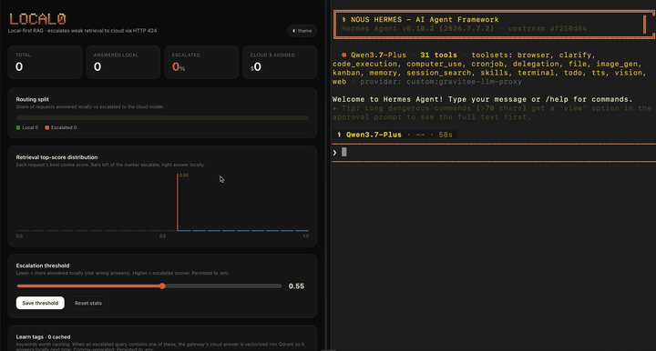

<div align="center">


**Local-first RAG endpoint that answers cheap questions locally and escalates hard ones to the cloud — automatically, behind your LLM gateway.**


-4c6ef5?style=for-the-badge)


[Quickstart](#-quickstart) · [Dashboard](#dashboard-8081dashboard) · [Config](#configuration) · [Gateway wiring](#gateway-wiring)

</div>

---

A **local-first RAG endpoint** that sits *behind* an LLM gateway as one provider.
A small local model (Qwen3 0.6B via Ollama) answers when document retrieval is
strong. When retrieval is weak the router returns **HTTP 424**, and a
response-based routing policy on the gateway reroutes the request to a big
cloud model.

**Why:** cheap, private, local answers for in-corpus questions; automatic
escalation to the cloud only when the local corpus can't help. No GPU.

```
Agent → LLM gateway → router-service (200 local)  or  424 → cloud model
                            │
                   Qdrant + host Ollama (Qwen3 0.6B + nomic-embed-text)
```

The router is **gateway-agnostic** (it only emits the 424 signal). Config push
goes through a `GatewayAdapter` so swapping vendors is an adapter swap, not a
rewrite. **v1 ships one adapter** (Gravitee APIM) — see Gateway wiring below.

## Prereqs

- Docker + Docker Compose
- **Ollama installed + running on the host** (`:11434`). `make quickstart` pulls the models for you.

## 🎥 Quick demo

[](assets/demo.mov)

## 🚀 Quickstart

One command — checks prereqs, clones, pulls models, starts, ingests:

```bash
curl -fsSL https://raw.githubusercontent.com/kaiwalyakoparkar/local0/master/install.sh | bash
```

Then open **http://localhost:8081/dashboard**, tune `THRESHOLD`, and you're live.

> Piping to `bash` runs remote code — [read `install.sh`](install.sh) first if you'd rather. It just clones the repo and runs `make quickstart` = `make models` (pull `qwen3:0.6b` + `nomic-embed-text`) → `make demo` (setup `.env` → start router+qdrant → ingest `./docs`).

Prefer to clone yourself?

```bash
git clone https://github.com/kaiwalyakoparkar/local0.git && cd local0 && make quickstart
```

Already have the models pulled? Run `make demo` instead of `quickstart`.

### Try it in 30 seconds

Send an OpenAI-compatible request:

```bash
curl localhost:8081/v1/chat/completions -H 'content-type: application/json' -d '{
  "messages": [{"role": "user", "content": "what does the router return on weak retrieval?"}]
}'
```

- In-corpus query → `200` with a local answer.
- Off-topic query → `424 {"detail": "no local context, escalate"}` (the escalation signal).

### Manual steps

```bash
make setup     # cp .env.example .env
make up        # docker compose up --build -d  (router + qdrant)
make ingest    # ingest ./docs into Qdrant
make test      # unit tests (mocked; needs `pip install pytest`)
make eval      # sweep THRESHOLD against eval_set.json (Phase 6)
make down
```

## Gateway wiring

The router only *raises* the 424 flag; **the gateway routes**. Many gateways'
built-in failover ignores HTTP status (retries only on transport failure), so
escalation needs a **response-based routing policy**: on upstream `424`,
reroute to provider #2.

Point your agent configuration at the gateway's local0 route:

```yaml
model:
  base_url: http://localhost:8082/local0/v1
custom_providers:
  - name: gravitee-llm-proxy
    base_url: http://localhost:8082/local0/v1
```

`app/gateway.py` defines `GatewayAdapter` and pushes an API definition that
embeds **both providers + the 424→reroute policy** via the gateway Management
API — see `plans/merged-plan.md` Phase 4/4b.

> **Current PoC:** only a Gravitee APIM adapter is implemented. Wire it against
> your APIM stack (sibling
> [Gravitee-AI-Agent-Workshop](https://github.com/gravitee-io-labs/Gravitee-AI-Agent-Workshop)
> works as a reference; copy the Hermes LLM Proxy API definition shape). A
> second vendor adapter is a non-goal for v1.

> **Open item (Phase 0.5):** confirm the gateway forwards the *original* user
> messages (not the RAG-augmented body) to the cloud model on reroute; add a
> passthrough branch if not.

## Dashboard (`:8081/dashboard`)

Router-served, single page, no framework. Live routing counters, a top-score
histogram with the threshold marker, a **THRESHOLD slider**, and a **Learn tags**
field — comma-separated keywords worth caching (persists to `.env` as
`LEARN_TAGS`). `/config` and `/stats/reset` are **local-network only** (loopback
plus private/Docker bridge IPs) — never exposed through the gateway. Save actions
show an error message if the request is rejected.

### Learn loop (gateway callback)

When retrieval misses and the gateway reroutes to the cloud, its response-policy
posts the final answer back to `POST /learn {query, answer}`. If the query
contains one of the `LEARN_TAGS`, the router vectorizes the Q&A into Qdrant so the
same question answers locally next time. `/learn` is reachable from the gateway
(not localhost-only); the dashboard's **Test /learn** button fakes the callback
locally. ponytail: no auth on `/learn` in v1 — add a shared secret if it's ever
exposed beyond the gateway network.

## Configuration

Everything lives in `.env` (see `.env.example`). Key knobs:

| Var | Meaning |
|---|---|
| `THRESHOLD` | escalate (424) when retrieval top_score < this. Default `0.55` (pre-eval guess; tune with `make eval`). |
| `OLLAMA_URL` | host Ollama. `host.docker.internal:11434` from a container. |
| `GEN_MODEL` / `EMBED_MODEL` | `qwen3:0.6b` / `nomic-embed-text` (768-dim, cosine). |
| `COLLECTION` | Qdrant collection name. |
| `CLOUD_USD_PER_CALL` | dashboard cost estimate (gross avoided, not net). |
| `LEARN_TAGS` | substrings that must appear in a query before `POST /learn` stores it. |
| `ADMIN_TOKEN` | when set, control-plane endpoints (`/config`, `/documents`, `/gateway/*`, `/stats/reset`, `/demo`) require an `X-Admin-Token` header. Unset = local-only Host check (dev). Set it for any non-local deploy. |
| `LEARN_TOKEN` | when set, `POST /learn` requires an `X-Learn-Token` header (the gateway callout injects it). |
| `MAX_BODY_BYTES` | reject larger request bodies with 413 (default 65536). |
| `STARTUP_TIMEOUT` | seconds to wait for Ollama models + Qdrant before exiting non-zero (compose restarts). `0` skips the gate. |
| `STATS_PATH` | JSON snapshot path for routing counters (compose points it at the `./data` volume). Empty = in-memory only. |
| `RERANK` | `on` enables a CPU cross-encoder rerank of fused candidates (needs `fastembed`; off by default). |
| `LOG_LEVEL` | `DEBUG`/`INFO`/`WARNING`/`ERROR`. |

## Layout

```
app/main.py       FastAPI: /v1/chat/completions, /stats, /config, /documents, /learn, /health, dashboard
app/rag.py        Qdrant hybrid retrieve() (dense + BM25 RRF) + collection management
app/ollama.py     host Ollama embed + chat (shared pooled client)
app/stats.py      routing counters + histogram, JSON snapshot persistence
app/gateway.py    GatewayAdapter (+ Gravitee PoC impl, deploy with rollback)
app/ui/           self-served dashboard (index.html, app.js, style.css) — no build step
ingest.py         walk ./docs → section-chunk → embed → upsert (idempotent)
eval.py           threshold sweep + confusion / precision-recall / MRR
tests/            mocked unit tests + gateway builder tests (no live services)
requirements-dev.txt / pyproject.toml   pytest + ruff config
.github/workflows/ci.yml                ruff → pytest → pip-audit
docs/sample/      committed frozen corpus for reproducible eval
```

## Runbook

| Symptom | Cause | What to do |
|---|---|---|
| Every request escalates (all 424, cloud bill climbing) | Ollama or Qdrant down — the router fails **open** to cloud by design | `curl :8081/health` (503 names the culprit); restart Ollama / `docker compose restart vectordb`; check `make logs` for `retrieval failed` / `generation failed` |
| Router container won't start / restarts | Startup gate can't reach Ollama or Qdrant within `STARTUP_TIMEOUT` | `make logs` shows `waiting for dependencies`; confirm host Ollama is up (`:11434`) and models pulled (`make models`) |
| `collection … predates hybrid retrieval` error | Collection built under the old dense-only schema | `make reingest` (drops + rebuilds under the v2 hybrid schema) |
| Retrieval quality poor / wrong local answers | Threshold mistuned or corpus duplicated | `make eval-fresh` for a fresh threshold + confusion matrix; re-ingest is idempotent so duplicates can't accumulate |
| `403` from dashboard actions | `ADMIN_TOKEN` set but no header | paste the token into the dashboard's token box (stored in `localStorage`, sent as `X-Admin-Token`) |
| Escalations happen but nothing is learned | gateway 424-reroute policy not calling `/learn` back | dashboard health panel flags "no /learn callback"; redeploy the gateway policy (`/gateway/deploy`) |

## Non-goals (v1)

Real token streaming (the refusal gate must read the whole answer before choosing
200-vs-424, so SSE is one delta — see the note in `_openai_sse`), PDF ingestion,
horizontal scale / multiple workers (routing counters + config live in-process;
run `--workers 1`), a second gateway adapter.
